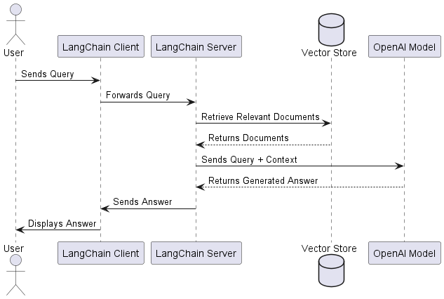

# LangChain RAG Application Project

This project demonstrates the use of LangChain to implement a Retrieval-Augmented Generation (RAG) application. The application integrates prompt templates, LLM chains, retrieval mechanisms, and conversation memory to answer user queries based on content from a web source.

## Getting Started

These instructions will get you a copy of the project up and running on your local machine and on AWS for development and testing purposes.

## Prerequisites

Make sure to have the following tools installed to run this project:

1. **Python (version 3.8 or higher)**
   - Download it from [python.org](https://www.python.org/downloads/).

   ```sh
   python --version
   ```
   It should display something like:

   ```sh
   Python 3.9.7
   ```

2. **Git**
   - Download it from [git-scm.com](https://git-scm.com/downloads).

   ```sh
   git --version
   ```
   It should display something like:

   ```sh
   git version 2.31.1
   ```

## Installation and Local Setup

### Clone the repository

Clone the repository to your local machine:

```bash
    git clone https://github.com/alexandrac1420/LLM_PrimeraParte.git
    cd LLM_PrimeraParte
```


## API Key Setup

This project requires API keys to access OpenAI and LangSmith. Follow the steps below to obtain them:

1. **OpenAI API Key**:
   - Go to [https://platform.openai.com/](https://platform.openai.com/) and log in to your account.
   - Go to your profile in the top-right corner and select "View API Keys."
   - Click on "Create new secret key" to generate a new key.
   - **Note**: Copy and save the key in a secure place, as you won’t be able to view it again after closing the dialog.

   More details: [Where do I find my OpenAI API Key?](https://help.openai.com/en/articles/4936850-where-do-i-find-my-openai-api-key)

2. **LangSmith API Key**:
   - Visit [https://smith.langchain.com/setup](https://smith.langchain.com/setup) and log in.
   - Once in, go to your account settings and generate a new API key.

   For more detailed instructions: [Create an account and API key in LangSmith](https://docs.smith.langchain.com/administration/how_to_guides/organization_management/create_account_api_key)

Within the Jupyter Notebook, set up the API keys by following the instructions in the code to set the environment variables `OPENAI_API_KEY` and `LANGCHAIN_API_KEY`.

## Usage Instructions

### Executing the Notebook
Run each cell in the notebook one by one, ensuring each step completes without errors. Below are key steps with expected results and their purpose:

1. **Loading and Splitting Blog Content for Indexing**:
   This step loads specific web content from a URL and divides it into manageable fragments for easier analysis and future retrieval. Relevant content is extracted using class filters (such as post title and content), ensuring the model accesses only the essential information. Splitting the text into smaller fragments optimizes model accuracy by enabling it to focus on relevant portions within its context limit.

2. **Checking the Length of the First Document**:
   Checking the length of the first loaded document ensures the entire content was loaded successfully. This is important because language models have a context limit, and knowing the text size helps plan better for processing and segmentation.

3. **Document Content Verification (first 500 characters)**:
   This step prints the first 500 characters of the document to visually verify that the content has loaded correctly and aligns with the source.

4. **Viewing Metadata for the Tenth Fragment**:
   Displaying metadata for a specific fragment helps verify details about the source and the fragment’s position within the original text. This information is useful to ensure that each fragment retains its context reference, essential for retrieval-augmented applications.

5. **Retriever Setup and Sample Query**:
   This step sets up a retrieval mechanism to find relevant fragments within the indexed content. By performing a sample query, we retrieve related fragments, allowing us to verify the model’s ability to locate and group pertinent information based on a question or specific topic.

6. **Running an Example Prompt Using Prompt Hub**:
   This step uses a predefined prompt template from the Prompt Hub, optimized for answering questions clearly and concisely. Running the prompt shows an example of how responses are structured for Q&A tasks, useful for standardizing interactions with the model.

7. **Printing Example Message Content**:
   Printing the content of an example message verifies that the prompt generates a clear, structured response following specific guidelines for answering a question using retrieved fragments.

8. **Example RAG Chain with Retrieved Document Formatting**:
   This step sets up a retrieval-augmented generation (RAG) chain allowing the model to generate responses using specific fragments from the indexed text. The generated response illustrates how the model uses contextual information to improve accuracy and relevance in its answers.

9. **RAG Chain with Templates and Q&A Responses**:
   Here, a more complex RAG chain is configured, including message templates to better structure model responses. The goal of this step is to produce concise, well-formatted responses in three sentences, allowing for detailed queries with a consistent response style.

## RAG Explanation (Retrieval-Augmented Generation)

Retrieval-Augmented Generation (RAG) is a method that integrates external data sources with language models, retrieving relevant data fragments to enhance generated responses. RAG improves response accuracy and quality by allowing the model to access specific contextual information.

## Architecture 

### Architecture Diagram


The architecture of this project follows a client-server structure where the **client**, represented by a Jupyter Notebook, executes code and makes API requests to interact with the language model. From this interactive environment, users can initiate queries and analyze the model's responses directly.

The **LangChain core** is fundamental for integrating with OpenAI. This component manages prompt creation, embedding generation, and vector storage, providing an interface between the client and the language model. LangChain allows requests sent to OpenAI to be structured and customized, facilitating interaction with the model.

The **retrieval mechanism** is essential for the RAG (Retrieval-Augmented Generation) process. It uses a vector database (vector store) to store relevant document segments, which are indexed and retrieved based on embeddings. This system enables the identification and extraction of the most relevant parts of the documents according to the user’s query.

The **OpenAI language model** is the component responsible for processing the retrieved data and generating responses based on the input prompt. By receiving contextual fragments and the query, the model produces precise and contextualized answers enriched with specific information from the document corpus.

Finally, **LangSmith tracing** provides a logging and monitoring system for API interactions, invaluable for debugging and analyzing application performance. LangSmith allows visualizing requests and responses generated, offering useful insights for workflow adjustment and optimization. This tracing capability enables better control over execution and helps identify areas for improvement in the communication between the client and the language model.


## Built With

- [LangChain](https://langchain.com/) - Library for developing LLM applications.
- [Jupyter Notebook](https://jupyter.org/) - Interactive development environment.
- [OpenAI](https://openai.com/) - Language model provider.

## Versioning

I use [GitHub](https://github.com/) for versioning. For the versions available, see the [tags on this repository](https://github.com/alexandrac1420/LLM_PrimeraParte.git).

## Authors

- **Alexandra Cortes** - [alexandrac1420](https://github.com/alexandrac1420)

## License

This project is licensed under GNU.

